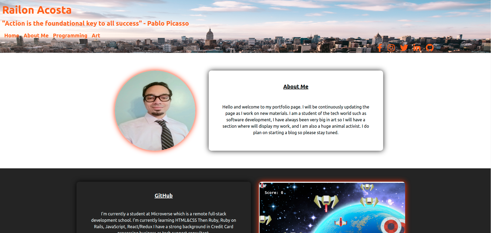

# Portfolio Template for Devs

<p align="center">
<a href="https://www.linkedin.com/in/railon-acosta/"></a>
<a href="https://www.instagram.com/railon.a/"></a>
<a href="railonacosta@gmail.com"></a>
</p>

> This is a Profesional Template, where one can clone the repo and subtitle the information with their own.


## Main screenshots



## Live preview link

- <https://railonacosta.herokuapp.com/>


## Description

### Tech Stack

This project is based in these main tech stacks :

- Ruby version 2.7.2
- Ruby on Rails 6.1.3

## Prerequisite

- To use the template, you need a basic understanding of Javascript
- To contribute, please make sure you follow best practices in the tech stacks specified before

## Get Started

> These steps are required to make you own copy of the project and get started, of contribution it is highly important to follow all of these steps and make sure you are following a correct Git flow workflow

1. Clone [Prefered] or fork the project to get a copy of it, by preference, clone it using

```
$ git clone git@github.com:RailonA/rails_professional_portfolio.git
```

2. Go to the directory

```
cd rails_professional_portfolio
```

3. Run

```
$ rails server
```

4. Open your browser on <http://localhost:3000/>


At this point you should be able to get a the project running in the default web browser, if not please make sure you folowed all the steps or open a well detailed issue


## Author

👤 **Railon Acosta**

- GitHub: [@railonA](https://github.com/RailonA)
- Linkedin: [@railonAcosta](https://www.linkedin.com/in/railon-acosta-81265180/)
- Twitter: [@railonAcosta](https://twitter.com/RailonAcosta)


## 🤝

Contributions, issues and feature requests are welcome!

Feel free to check the [issues page](https://github.com/RailonA/rails_professional_portfolio/issues).

## Show your support

Give a ⭐️ if you like this project!

## License

This project is [MIT](lic.url) licensed.
{"mode":"full","isActive":false}